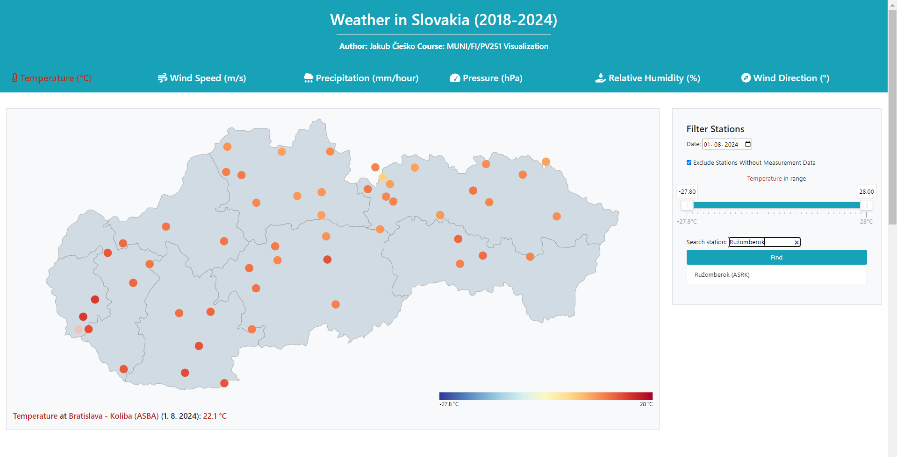
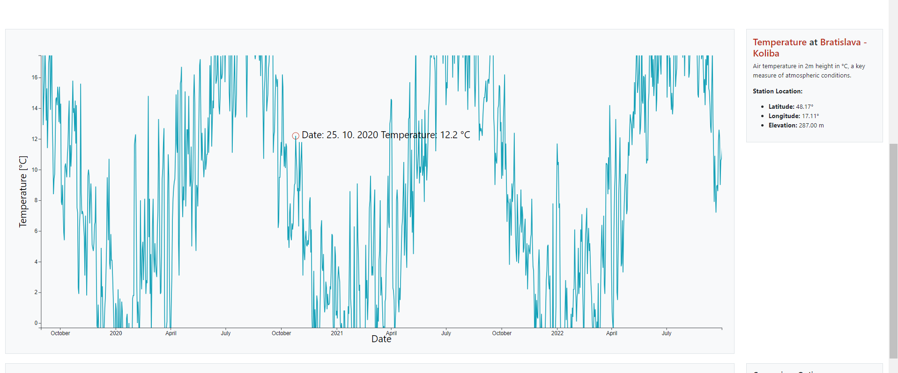
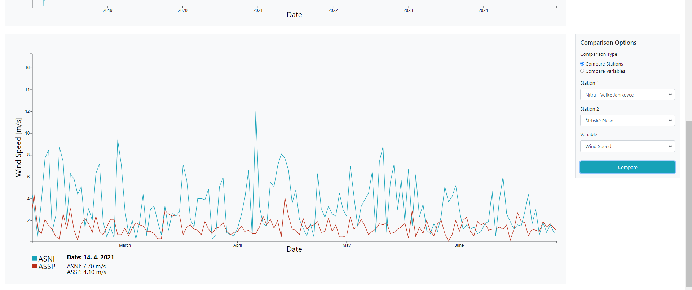
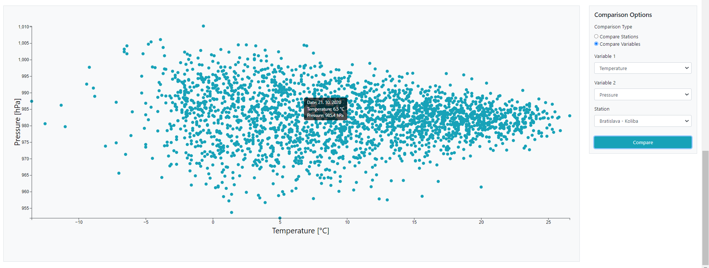
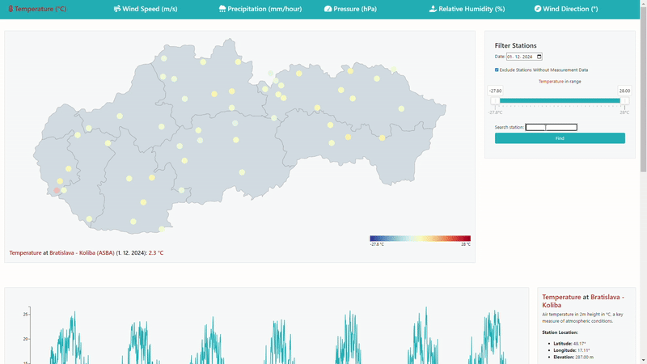

# Weather Visualization Project

This project visualizes Slovak weather data from 2018 to 2024, focusing on trends, anomalies, and geographical distributions. The visualization aims to make meteorological data more accessible and interactive.

## Live Demo
Explore the project here: [Weather Visualization App](https://jakubciesko.github.io/vizu/)

## Features
- Compare weather stations and variables of choice.
- Interactive charts with zoom and cursor features.
- Rose diagrams for wind directions.
- Heatmaps, line charts, and precipitation visuals.

## Technologies Used
- **Frontend**: D3.js, Bootstrap, [noUiSlider](https://refreshless.com/nouislider/) (for range sliders)
- **Backend/Data**: Python (Pandas, Numpy), SensorThings API

## Data Source
- Slovak Hydrometeorological Institute’s [INSPIRE & OpenData Project](https://github.com/danubehack/2017_01_SHMU-INSPIRE-OpenData/wiki)

## Screenshots
### Application Overview





### Interactive Demo


## How to Run
1. Clone the repository and move to branch **node**:
   ```bash
   git clone https://github.com/JakubCiesko/vizu.git
    cd vizu
    git checkout node
2. Start a local server using http-server:
    ```bash 
    node index.js

You can get node at the official [Node.js website](https://nodejs.org/). You need to have express installed. Run:
    ```bash
    npm install express 
    
You need npm installed.
3. Open the provided localhost URL in your browser: http://localhost:3000

